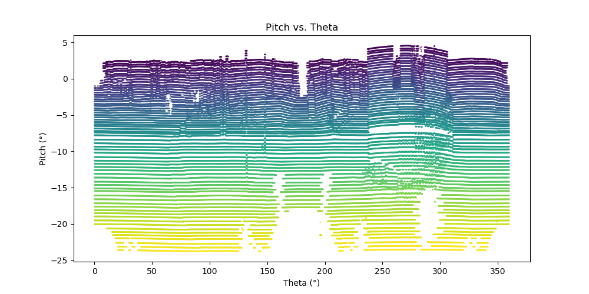

# kitti_raw_to_rosbag

为了在KITTI数据集上验证 SLAM 算法（如 FAST-LIO 等），通常需要以下数据特性：
- 未去畸变的原始点云，包含每个点的时间戳
- 高频率的IMU数据

常用的 KITTI 转 ROSbag 工具 [kitti2bag](https://github.com/tomas789/kitti2bag)、 [kitti_to_rosbag](https://github.com/ethz-asl/kitti_to_rosbag) 处理后的包只有10Hz的点云数据，并且使用的是去畸变后的点云。

本kitti_raw_to_rosbag工具使用基于 [KITTI](https://www.cvlibs.net/datasets/kitti/raw_data.php) 官网提供的 “unsynced+unrectified data“ 数据，具备以下功能：
- 发布未去畸变的 Velodyne 点云（10Hz）
- 发布高频IMU数据（100Hz）
- 为每帧点云中的点添加 ring 字段（0-63）
- 为每帧点云中的点添加 time 字段（0-0.1s）
  
  


这个工具主要是方便自己用，本身并不复杂，主要参考并修改 [pykitti](https://github.com/utiasSTARS/pykitti)，顺手整理分享出来，分享给可能也用得上的人。

## 1. 数据集准备
### 1.1 下载
请先在 [KITTI](https://www.cvlibs.net/datasets/kitti/raw_data.php) 上下载对应的 raw 文件。

在 KITTI 官网中 odometry 页面里可以下载的 80GB odometry data set (velodyne laser data) 包含 22 组数据，其中 11 组带有 ground truth，压缩包本身太大，因此可以下载对应raw数据如下：


```
Nr.     Sequence name     Start   End   Size(GB)
---------------------------------------------
00: 2011_10_03_drive_0027 000000 004540 17.6
01: 2011_10_03_drive_0042 000000 001100 4.5
02: 2011_10_03_drive_0034 000000 004660 18.0
03: 2011_09_26_drive_0067 000000 000800
04: 2011_09_30_drive_0016 000000 000270 1.1
05: 2011_09_30_drive_0018 000000 002760 10.7
06: 2011_09_30_drive_0020 000000 001100 4.3
07: 2011_09_30_drive_0027 000000 001100 4.3
08: 2011_09_30_drive_0028 001100 005170 20.0
09: 2011_09_30_drive_0033 000000 001590 6.2
10: 2011_09_30_drive_0034 000000 001200 4.8
```
注意 80G 的文件里面的点云为.bin格式，raw文件为里面的点云为.txt格式，如果是.bin格式需要手动进行修改程序，但处理速度可能会加快。
### 1.2 格式
下载完 raw 数据和标定文件之后，图像文件可以删掉（这个包用不到图像），目录结构整理成下面这样，放在 kitti_raw_to_rosbag 目录下。
```
2011_09_30
├── 2011_09_30_drive_0018_extract
│   ├── oxts
│   │   ├── data
│   │   ├── dataformat.txt
│   │   └── timestamps.txt
│   └── velodyne_points
│       ├── data
│       ├── timestamps_end.txt
│       ├── timestamps_start.txt
│       └── timestamps.txt
├── calib_cam_to_cam.txt
├── calib_imu_to_velo.txt
└── calib_velo_to_cam.txt
```
## 2. 转换包
修改 process_kitti.py 中的 basedir、date、drive，然后运行：

```
$ cd ~/slam_ws/src/kitti_raw_to_rosbag
$ python3 -m kitti_to_rosbag_gio.process_kitti
```
漫长的等待过后，会得到转换过后的包。


## 3. 分析与实现细节
注释掉 process_kitti.py 里面的 
```
make_bag(dataset)
```
然后取消注释
```
test_point_format(dataset)
```
可以分析kitti数据集某一帧的格式。

### 3.1 kitti 格式分析
velodyne_points/data 下的每一个 .txt 文件就是一帧点云数据，每一行代表一个点。可以用 arctan(y/x) 计算每个点的扫描角度（也就是它在水平面的方向）。观察数据后发现，这些点并不是按时间顺序排列的，而是先把同一条激光线上的点放一起，然后一共64条线依次排列。

也就是说，点云的顺序是“先把每条线的点集中起来”，线内的点才是按照时间顺序排的。这一点很重要，尤其是在给点云加环号（ring）和时间戳的时候。


用 arctan[z/(x^2+y^2)^0.5] 计算每个点的俯仰角。可以看见，每一线上的点云，虽然整体趋势是俯仰角随着线数增加逐渐减小，但它的俯仰角并不稳定。这一点也可以在 pitch—theta 图上直观地看出来，一条线上的点云，俯仰角会上下波动。这一点不知是否是我的理解有误。




### 3.1 ring
因此，根据格式上的分析，用俯仰角来区分环数难以实现，因此主要使用旋转角度来区分环数。

通过记录旋转角度（theta）从360°降到0°的点的index，来批量为点赋值 ring，如下图所示，ring 为从0到64,具体实现在 process_kitti.py 的 save_velo_data 函数里。


### 3.2 time
在有了每个点的 ring 之后，就可以为每个点分配时间了。这里没有使用固定的 0.1s，而是使用每帧点云的 timestamps_end 减去 timestamps_start，再根据每个 ring 上点的个数，对时间进行线性插值，时间精度为微秒级。每帧点云的header.stamp使用数据集中的 timestamps_start。


