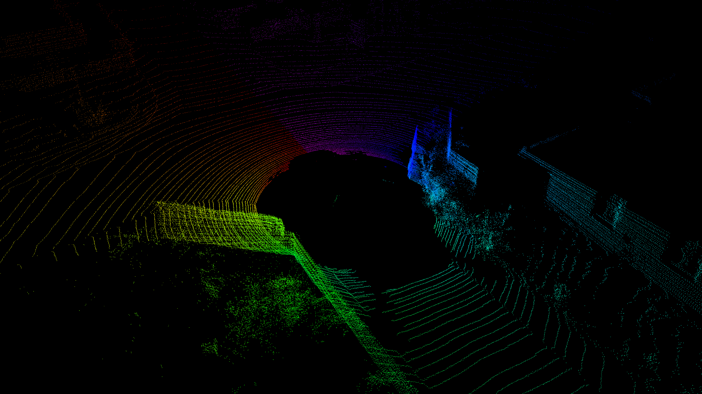

# kitti_raw_to_rosbag

To validate SLAM algorithms (such as FAST-LIO) on the KITTI dataset, the following data characteristics are usually required:
- Raw undistorted point clouds with per-point timestamps
- High-frequency IMU data

Common tools for converting KITTI to ROSbag such as [kitti2bag](https://github.com/tomas789/kitti2bag) and [kitti_to_rosbag](https://github.com/ethz-asl/kitti_to_rosbag) only produce 10Hz point clouds and use rectified data.

This `kitti_raw_to_rosbag` tool uses the “unsynced+unrectified data” provided by the [KITTI website](https://www.cvlibs.net/datasets/kitti/raw_data.php), and provides the following features:
- Publish undistorted Velodyne point clouds (10Hz)
- Publish high-frequency IMU data (100Hz)
- Add a `ring` field (0–63) to each point in the cloud
- Add a `time` field (0–0.1s) to each point in the cloud


This tool was mainly built for personal use. It's not complicated, and mostly based on [pykitti](https://github.com/utiasSTARS/pykitti), shared here in case others find it useful.

## 1. Dataset Preparation
### 1.1 Download
Please download the corresponding raw files from [KITTI](https://www.cvlibs.net/datasets/kitti/raw_data.php).

The 80GB odometry dataset available on the KITTI odometry page includes 22 sequences, 11 of which contain ground truth. Since the compressed package is large, you can instead download the corresponding raw data as follows:

```
Nr.     Sequence name     Start   End   Size(GB)
---------------------------------------------
00: 2011_10_03_drive_0027 000000 004540 17.6
01: 2011_10_03_drive_0042 000000 001100 4.5
02: 2011_10_03_drive_0034 000000 004660 18.0
03: 2011_09_26_drive_0067 000000 000800
04: 2011_09_30_drive_0016 000000 000270 1.1
05: 2011_09_30_drive_0018 000000 002760 10.7
06: 2011_09_30_drive_0020 000000 001100 4.3
07: 2011_09_30_drive_0027 000000 001100 4.3
08: 2011_09_30_drive_0028 001100 005170 20.0
09: 2011_09_30_drive_0033 000000 001590 6.2
10: 2011_09_30_drive_0034 000000 001200 4.8
```

Note: The 80GB odometry files contain `.bin` point clouds, while the raw files contain `.txt`. If you use `.bin` format, you'll need to modify the script manually, though it may run faster.

### 1.2 Format
After downloading the raw data and calibration files, you can delete the image files (they are not needed here). Organize the folder structure as follows and place it under the `kitti_raw_to_rosbag` directory.

```
2011_09_30
├── 2011_09_30_drive_0018_extract
│   ├── oxts
│   │   ├── data
│   │   ├── dataformat.txt
│   │   └── timestamps.txt
│   └── velodyne_points
│       ├── data
│       ├── timestamps_end.txt
│       ├── timestamps_start.txt
│       └── timestamps.txt
├── calib_cam_to_cam.txt
├── calib_imu_to_velo.txt
└── calib_velo_to_cam.txt
```

## 2. Convert Bag
Modify `basedir`, `date`, and `drive` in `process_kitti.py`, then run:

```
$ cd ~/slam_ws/src/kitti_raw_to_rosbag
$ python3 -m kitti_to_rosbag_gio.process_kitti
```

After a long wait, you will get the converted ROS bag file.


## 3. Analysis and Implementation Details
Comment out the following line in `process_kitti.py`:
```
make_bag(dataset)
```
Then uncomment:
```
test_point_format(dataset)
```
This allows you to inspect the format of a single frame in the KITTI dataset.

### 3.1 KITTI Format Analysis
Each `.txt` file under `velodyne_points/data` is a point cloud frame. Each row is a point. You can compute the horizontal angle with `arctan(y/x)` (i.e., direction on the horizontal plane). After examining the data, it appears that points are **not** in time order. Instead, points from the same laser ring are grouped together, and there are 64 such lines.

That is, the point cloud is ordered by laser ring first; within each ring, the points are in temporal order. This is important, especially when assigning ring ID and timestamp to each point.


Use `arctan[z / sqrt(x^2 + y^2)]` to compute pitch angles. You will see that although pitch generally decreases with increasing ring ID, it is not stable within a ring. This is also clearly visible in the pitch–theta plots, where pitch fluctuates within a single ring. It is unclear if this is sensor noise or something else.


### 3.1 ring
Due to the instability of pitch, it is difficult to infer the ring ID from pitch. Therefore, this tool mainly uses the horizontal angle (`theta`) to differentiate rings.

By recording the index where `theta` drops from 360° to 0°, the tool assigns `ring` values in batches from 0 to 64. The implementation is in the `save_velo_data` function in `process_kitti.py`.


### 3.2 time
After assigning rings, you can assign time to each point. Instead of using a fixed 0.1s, the actual frame duration is computed as `timestamps_end - timestamps_start`, and time for each point is linearly interpolated within its ring. Time precision reaches the microsecond level. Each frame's `header.stamp` uses the dataset’s `timestamps_start`.


